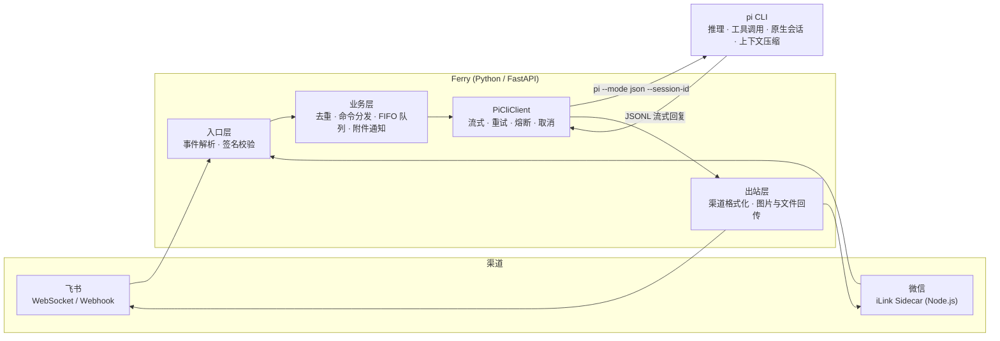
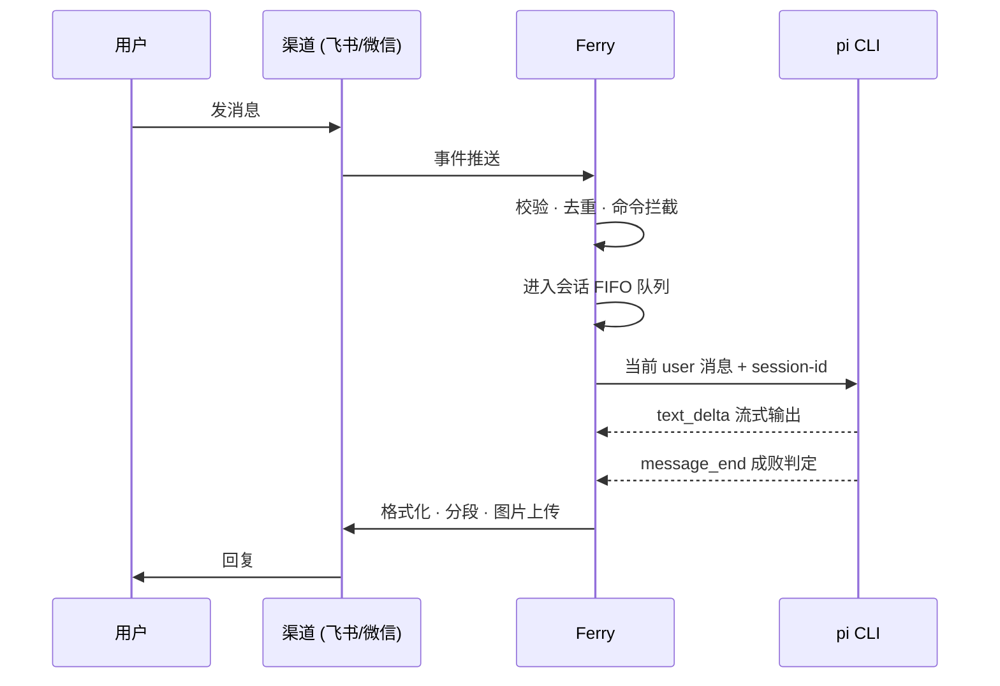

# Ferry

把飞书和微信的消息，交给同一个 pi

> 能力归 pi，编排归 Ferry。不造智能，只做消息收发、渠道适配与进程管理

Ferry 是一个个人 IM 桥接服务。飞书和微信的消息进来，经过去重、排队、命令分发，交给唯一的后端 pi 处理；pi 的回复再按渠道各自格式化送回去。会话历史、上下文压缩、工具调用全部留在 pi 原生层，桥接层一份都不重复实现

## 设计哲学

两条原则决定了这个项目的形状

**pi-native**：pi 原生支持的能力，桥接层不重复实现。会话靠 pi 的 `--session-id` 续接，压缩靠 pi 自己管，工具调用由 pi 承担。桥接层每轮只发当前这一条消息，历史一字不带

**桥接不膨胀**：不做 prompt 工程，不做 RAG，不做 workflow 引擎，不为想象中的多后端预留路由框架。单实例、文件持久化，不引入 Redis 和数据库。一个个人项目，简单本身就是功能

## 架构



一次请求的完整路径



## 能力

- 双渠道对话：飞书走 WS 长连接，微信走 Node.js sidecar 长轮询，共享同一套会话逻辑
- 飞书渐进式回复：占位卡先落地，pi 跑工具时卡片显示当前在跑的工具，正文到达后逐步覆盖同一张卡（微信整段回复不变）
- 会话隔离与秩序：渠道会话 key → pi session 映射，消息去重，FIFO 排队，任务可取消
- pi 生命周期管理：超时、重试、熔断、取消回收；部分流式输出后不重试，避免答一半重来
- 文件与图片：入站图片经 pi 原生 `@file` 多模态喂给模型（飞书图文混排、微信图片均可），文件归档后附件通知搭载下一条消息，双渠道文件推送
- 长期记忆与规则：`rules/` 与记忆经 `--append-system-prompt` 每轮注入，时间与时段走 system prompt，不污染 transcript
- 定时能力：`/remind` 一次性提醒，`/daily` 每日任务，均持久化到本地文件
- 私有可观测：独立看板进程统计轮次、阶段耗时、Token、工具与回发结果，另从 pi 原生历史只读采集全量 Token 用量；只看运行状态，不采集聊天正文

## 快速开始

前置条件：Python 3.13+、可用的 pi CLI（先完成模型配置）、微信接入另需 Node.js

```bash
# 仅首次创建，保留已有配置
[ -f conf/.env ] || cp conf/.env.example conf/.env

python3 -m venv .venv
.venv/bin/python -m pip install -r conf/requirements.txt
```

编辑 `conf/.env`，填写飞书凭证 `FEISHU_APP_ID`、`FEISHU_APP_SECRET`，确认 `PI_CLI_BIN`、`PI_MODEL` 及模型服务凭证。候选模型在 `conf/pi/models.json`，启动时自动同步到 `~/.pi/agent/models.json`

```bash
./bin/server start
./bin/server status
```

微信首次登录与独立启动

```bash
./bin/server wx login
./bin/server wx start
```

### Supervisor 托管

生产部署走 Supervisor 时，`./bin/server` 会自动检测并提示使用 supervisorctl，无需手动区分

```bash
supervisorctl status
supervisorctl restart 'ferry-stack:*'
curl --fail http://127.0.0.1:8080/healthz
```

> `/healthz` 只证明 HTTP 服务活着，不代表模型调用或渠道收发已验证

### 私有可观测看板

独立进程，默认 `127.0.0.1:38080/observability`，与主服务分开启停（Supervisor program 名 `ferry-observability`）。看板只回答"跑得怎么样"，不回答"聊了什么"：采集业务轮次、pi 尝试、可见模型响应、工具调用、队列与渠道回发结果，不采集聊天正文、思考、工具参数与结果、文件名与路径、原始报错；会话只以 HMAC 去标识化 ID 出现，且不作为 Prometheus 标签

```bash
./bin/server obs credentials   # 首次生成私有配置，显示随机密码；已有凭证不覆盖
./bin/server obs start
./bin/server obs status
# 远程访问：在自己的电脑执行
ssh -N -L 38080:127.0.0.1:38080 <服务器>
```

页面按时间窗口、渠道、模型筛选，五个页签

| 页签 | 内容 |
|---|---|
| 总览 | 轮次与错误趋势、渠道与状态分布、最近轮次（仅元数据，无正文） |
| 性能 | 各阶段耗时 P50 / P95 / P99 与均值、工具调用次数与错误（不含工具输入输出） |
| Token 用量 | pi 原生历史全量用量，见下一节 |
| 可靠性 | 错误轮次、取消轮次、重试、回发失败；采集质量（丢弃事件、写入错误、无效行、缺失用量）与告警 |
| 运行状态 | 主服务资源与运行快照，不随窗口和渠道筛选 |

访问控制分三层，凭证互不通用

| 入口 | 凭证 |
|---|---|
| 浏览器 | 单用户密码登录：scrypt 哈希 + 服务端 Session（默认 24h）+ 登录限流与 Origin 校验 |
| `GET /api/observability/v1/*`、`GET /metrics` | 独立只读 Bearer Token，供 LLM 或脚本读取；不能改会话、不能上报 |
| `POST /internal/observability/events` | 独立写 Token，且只接受回环来源；Nginx 模板对外返回 404 |

凭证只存 `conf/.env.observability`（0600、gitignored），由 `./bin/server obs credentials` 生成，不提供默认密码，明文密码不落盘也不入日志；只读 Token 与写 Token 不允许同值，配置校验直接拒绝

对外部署示例地址 `https://observability.example.com/observability`（替换为自己的域名），后端可监听 `0.0.0.0:38080` 并设 `OBSERVABILITY_COOKIE_SECURE=true`，不要用裸 HTTP 38080 提交登录密码。上面的 SSH 隧道方式适用于回环监听 + 关闭 Secure Cookie 的私有部署。Supervisor / Nginx 安装、完整接口清单、数据保留与完整性限制见 [运维说明](docs/RELIABILITY.md)

#### pi 历史 Token 用量

「Token 用量」页参考 `dsh-panel`，只读扫描 pi 原生 JSONL 的 usage 元数据，不复制正文、不改原生会话：7/14/30/90 天、自定义（最多十年）与全部历史，180/365 天活动热力图，模型堆叠日趋势与缓存读取率，Top 5 + 其他环图、排名与模型明细。日界统一 Asia/Shanghai，缺记录不补零。这部分与 Ferry 实时埋点是两本账，Token 不相加

```bash
# 在 conf/.env.observability 开启 OBSERVABILITY_PI_USAGE_ENABLED=true
# 可选 OBSERVABILITY_PI_SESSION_DIRS 为 JSON 数组；默认使用 pi agent 目录的 sessions
./bin/server obs sync       # 首次导入或手动增量同步，重复执行不会重复计数
./bin/server obs restart    # 启动后台持续同步，默认每 30 秒检查变化文件
```

机器读取：`GET /api/observability/v1/usage?range=all`（custom 带 `start` / `end`，`refresh=1` 触发后台单飞同步），沿用同一只读 Token。用量存在独立不过期账本 `runtime/observability/pi-usage/index.json`，不受运行事件 30 天保留期限制；上下文压缩与分支摘要用量计入消耗但不增加用户轮次，费用不估算

> 边界：运行事件从启用后开始采集，不回填聊天历史；读端最多缓存 200000 条，达上限明确提示不完整。写盘失败或队列溢出不阻断 IM，但未落盘事件在异常退出时可能丢失；未闭合轮次显示运行中或未知，不补成成功。Prometheus counter 随进程重启归零，`/healthz` 只说明观测 HTTP 存活

## 对话命令

| 命令 | 行为 |
|---|---|
| `/help` | 查看当前渠道帮助 |
| `/new`、`/reset` | 清空附件与 pi 会话映射，下轮开启新上下文 |
| `/stop` | 取消当前任务并清空排队消息 |
| `/skills` | 查询本机可用技能 |
| `/remind 10m 内容` | 定时提醒，支持 `s/m/h/d`，微信暂不支持 |
| `/daily 08:00 提示词` | 每日任务，支持 `list`、`cancel <id>` |

`/compact` 只说明上下文由 pi 原生管理，不执行手工压缩；旧后端切换命令只提示已移除

## 配置

全部配置项见 [conf/.env.example](conf/.env.example)，常用的几个

| 配置 | 说明 |
|---|---|
| `PI_CLI_BIN` | pi 命令名或绝对路径，默认 `pi` |
| `PI_MODEL` | `provider/model-id`，改这一行加重启即切换模型 |
| `PI_WORK_DIR` | pi 工作目录，默认 `./runtime/codex-workdir/pi` |
| `PI_TIMEOUT_SECONDS` | 单次 CLI 尝试总时限，默认 180 秒 |
| `PUSH_API_TOKEN` | 出站文件推送 `POST /push/file` 的鉴权 |
| `OBSERVABILITY_ENABLED` | 主服务是否埋点；观测服务自身凭证与开关在 `conf/.env.observability` |

迁移注意：旧 `CODEX_*` 键仅作回退；不要直接移动现有 cwd、session store 或 agent dir，恢复会话需要映射与 pi transcript 同时可用。详见 [单 pi 接入与迁移](docs/routing.md)

## 测试

```bash
.venv/bin/python -m pytest -c conf/pytest.ini -q
node --test tests/wechat-sidecar.test.mjs
```

`tests/` 是本地目录，不随仓库分发（已取消跟踪 + `.gitignore`）：clone 下来无测试可跑，用例映射见 [测试要点](docs/TEST.md)

验收清单见 [核心功能回归测试](docs/functional-tests.md)，每次迭代必过

## 项目结构

```text
bin/          服务控制与托管启动入口
conf/         环境配置、pi 模型注册表、依赖与 pytest 配置
lib/python/   应用入口、双渠道、PiCliClient、会话与队列、可选观测
lib/js/       微信 sidecar
rules/        注入 pi 的规则：system.md 公共 / admin.md 私有（gitignored）
skills/       项目级技能
memory/       长期记忆
runtime/      会话映射与运行状态
tests/        Python 与 Node 测试（本地目录，不入库）
docs/         架构、运维与变更记录
```

## 文档

[文档索引](docs/index.md) · [架构设计](docs/architecture.md) · [核心设计信念](docs/core-beliefs.md) · [会话管理](docs/sessions.md) · [变更记录](docs/requirement-changes.md)

## 许可

MIT
