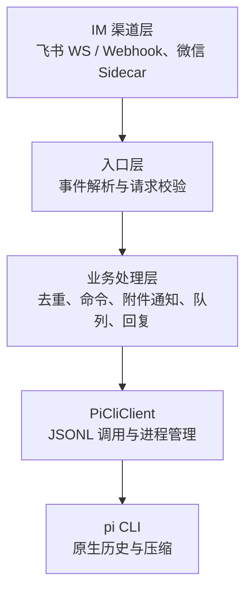
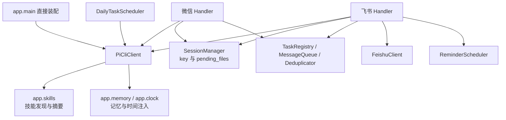

# Architecture

## 技术栈

| 类别 | 技术 | 用途 |
|------|------|------|
| 语言 | Python 3.13+ | 服务主体 |
| 框架 | FastAPI + Uvicorn | Webhook 路由与异步处理 |
| HTTP | httpx | 渠道 API 调用 |
| 配置 | pydantic-settings | 环境变量绑定与校验 |
| 加密 | cryptography | 飞书回调解密（AES-CBC） |
| Sidecar | Node.js | 微信 iLink Bot 长轮询 |
| 唯一后端 | pi（Pi Coding Agent） | AI 推理、原生会话与上下文压缩 |

## 架构分层



## 核心模块交互



`app.main` 不再构造路由器或保存 `active_backend`。`core.agent.types.AgentClient` 是供渠道、调度器和测试替身使用的轻量 Protocol，不是多后端扩展框架；同模块定义 `AgentClientError` / `AgentClientCancelled`

## 目录结构

```
codeClaw/
├── bin/                        # 服务控制脚本
├── conf/                       # 配置模板、模型注册表、依赖、pytest 配置
├── lib/
│   ├── python/
│   │   ├── app/                # 入口、配置、命令、skills、记忆、时间、日志
│   │   ├── channel/
│   │   │   ├── feishu/         # 飞书渠道全链路
│   │   │   └── wechat/         # 微信渠道
│   │   └── core/
│   │       ├── agent/          # pi_cli 与 types；无 router 或其它 CLI 实现
│   │       └── session/        # key/附件、去重、队列、任务、提醒、每日任务
│   └── js/
│       └── wechat-sidecar.mjs  # 微信 sidecar
├── tests/                      # Python 与 Node 测试
└── docs/                       # 项目文档，索引见 index.md
```

## 状态与部署

- 单实例 Uvicorn 进程，服务管理入口 `./bin/server`
- 仅依赖 pi agent CLI；不再检查或启动其它 agent CLI
- `PI_WORK_DIR` 是最终 cwd，默认 `./runtime/codex-workdir/pi`；保留旧路径名称是为了兼容会话，不表示仍支持旧后端
- pi 映射默认 `runtime/server/pi-sessions.json`，pi transcript 默认在 `~/.pi/agent/sessions/` 下按 cwd 组织
- 提醒与每日任务分别持久化到 `runtime/server/reminders.json`、`runtime/server/daily-tasks.json`；长期记忆及微信 sidecar 状态沿用既有文件
- `SessionManager` 不持久化对话历史，附件通知、消息队列与运行中任务为内存态
- 不再读写后端选择状态；旧状态文件和其它用户运行数据不自动删除
- 现有 pi cwd、session store、agent dir 不自动迁移；配置回退与迁移约束见 [routing.md](routing.md)

## 数据流

```
用户消息 → 飞书 / 微信 → 事件校验与去重
  → 命令直接响应，普通消息进入会话 FIFO 队列
    → 附件通知搭载当前 user 文本（不拼接历史）；入站图片下载归档为 image_paths
      → PiCliClient.chat_stream() / chat()
        → pi --mode json --session-id <id> [@图片路径...] <prompt>
          → JSONL text_delta + 最后一条 assistant message_end 成败判定
            → 渠道格式化 / 分段 / 图片上传 / 回复
```

文件归档、图片发现、出站 `/push/file`、定时、长期记忆与队列功能继续保留。入站图片经 pi 原生 `@file` 位置参数作为多模态输入传给模型（飞书图文混排、微信图片均支持）。时间与规则、记忆经 `--append-system-prompt` 注入；技能发现归 `app.skills`，不依赖已删除的后端模块
