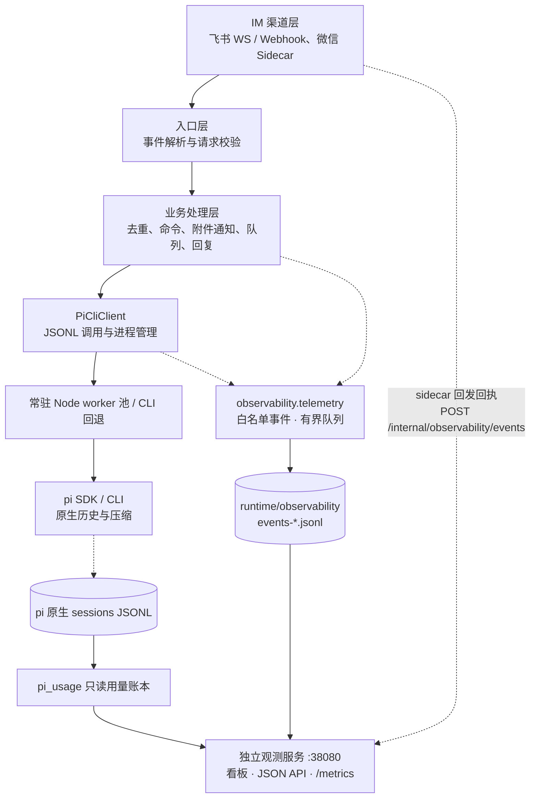
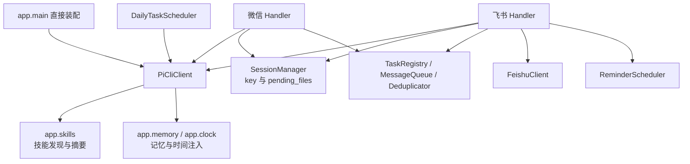

# Architecture

## 技术栈

| 类别 | 技术 | 用途 |
|------|------|------|
| 语言 | Python 3.13+ | 服务主体 |
| 框架 | FastAPI + Uvicorn | Webhook 路由与异步处理 |
| HTTP | httpx | 渠道 API 调用 |
| 配置 | pydantic-settings | 环境变量绑定与校验 |
| 加密 | cryptography | 飞书回调解密（AES-CBC） |
| Sidecar | Node.js | 微信 iLink Bot 长轮询 |
| 唯一后端 | pi（Pi Coding Agent） | AI 推理、原生会话与上下文压缩 |
| 可观测 | 独立 ASGI 进程 + 本地 JSONL 账本 | 运行事件、Prometheus 指标、pi 历史 Token 用量（可选、无正文） |

## 架构分层



## 核心模块交互



`app.main` 不再构造路由器或保存 `active_backend`。`core.agent.types.AgentClient` 是供渠道、调度器和测试替身使用的轻量 Protocol，不是多后端扩展框架；同模块定义 `AgentClientError` / `AgentClientCancelled`

## 目录结构

```
Ferry/
├── bin/                        # 服务控制脚本（主服务 / 微信 / 观测）
├── conf/                       # 配置模板、模型注册表、依赖、pytest 配置、观测托管模板
├── lib/
│   ├── python/
│   │   ├── app/                # 入口、配置、命令、skills、记忆、时间、日志
│   │   ├── channel/
│   │   │   ├── feishu/         # 飞书渠道全链路
│   │   │   └── wechat/         # 微信渠道
│   │   ├── core/
│   │       ├── agent/          # pi_cli、pi_worker 进程池与 types
│   │       └── session/        # key/附件、去重、队列、任务、提醒、每日任务
│   │   └── observability/      # 可选观测：埋点、事件账本、看板服务、pi 用量账本
│   └── js/
│       ├── pi-worker.mjs       # 常驻 pi SDK JSONL worker
│       └── wechat-sidecar.mjs  # 微信 sidecar
├── tests/                      # Python 与 Node 测试（本地目录，不入库）
└── docs/                       # 项目文档，索引见 index.md
```

## 状态与部署

- 单实例 Uvicorn 进程，服务管理入口 `./bin/server`
- 仅依赖 pi agent CLI；不再检查或启动其它 agent CLI
- `PI_WORK_DIR` 是最终 cwd，默认 `./runtime/codex-workdir/pi`；保留旧路径名称是为了兼容会话，不表示仍支持旧后端
- pi 映射默认 `runtime/server/pi-sessions.json`，pi transcript 默认在 `~/.pi/agent/sessions/` 下按 cwd 组织
- 提醒与每日任务分别持久化到 `runtime/server/reminders.json`、`runtime/server/daily-tasks.json`；长期记忆及微信 sidecar 状态沿用既有文件
- `SessionManager` 不持久化对话历史，附件通知、消息队列与运行中任务为内存态
- 不再读写后端选择状态；旧状态文件和其它用户运行数据不自动删除
- 现有 pi cwd、session store、agent dir 不自动迁移；配置回退与迁移约束见 [routing.md](routing.md)
- 观测是独立进程（默认 `127.0.0.1:38080/observability`），主服务仅在 `OBSERVABILITY_ENABLED=true` 时埋点；写盘失败或队列溢出不阻断 IM
- 运行事件账本 `runtime/observability/events-*.jsonl` 默认保留 30 天；pi 历史用量是独立不过期账本 `runtime/observability/pi-usage/index.json`（目录 0700 / 文件 0600）
- 观测凭证只存 `conf/.env.observability`（0600、gitignored），由 `./bin/server obs credentials` 生成；Supervisor program 名 `ferry-observability`，与 `ferry-stack:*` 分开重启

## 常驻 pi 运行时

`PI_PERSISTENT_ENABLED=true` 时，`PiCliClient` 通过 `core/agent/pi_worker.py` 的有界池调用 `lib/js/pi-worker.mjs`。Node 和 pi 模块只初始化一次；每轮仍创建并释放原生 AgentSession，重新加载 AGENTS.md、规则、skills、记忆和时间，沿用原有 transcript。不是长期缓存一份聊天上下文，也不改 pi 的工具或推理逻辑

- 默认池大小 2，启动预热；每个 worker 一次只处理一个请求，同一 session ID 串行；实际取得 worker 后再刷新规则/记忆/时间输入，避免排队导致过期
- HTTP 初始化沿用 pi 原生代理/NO_PROXY 与空闲超时设置，相同配置复用 dispatcher，配置变化后有界释放旧连接
- JSONL 请求带关联 ID，`ferry_done` 在 prompt、重试/压缩及清理完成后发出；`agent_end` 不代表可复用
- 取消/超时先 SIGTERM，让 pi 清理独立 bash 进程组，1 秒后仍未退出则 SIGKILL；Linux 下额外记录该 worker 的后代 PID/启动时间/PGID，Node 卡死或崩溃也能回收独立工具组，并防止 PID 复用误杀。失败的 worker 不回池，后续按需补建；关闭服务回收全部 worker
- 需配置 `PI_NODE_BIN`（与 pi 匹配的 Node，当前验证 22.23.2）和 `PI_SDK_MODULE`（安装目录的 `dist/index.js` 绝对路径）；当前适配锁定 pi 0.84.2，升级 pi 后需回归再调整版本约束
- 设置 `PI_PERSISTENT_ENABLED=false` 并重启可回退原 CLI，不迁移/清空会话。其它模型、thinking、规则配置仍沿用 `conf/.env`
- 观测：`pi.worker_ready` 记录启动耗时/PID；`pi.worker_turn_ready` 记录逐轮准备耗时与是否复用；`pi.worker_first_text` 记录本次 lease 到首字耗时；`pi.tool_call` / `pi.tool_result` 记录单个工具的开始时刻、耗时与成败。`pi.chat/stream.duration_ms` 仍是包含池等待、重试等的完整调用耗时。飞书每次出站请求由 client 传输层统一打点 `duration_ms` / `attempt`；日志 formatter 收全部 extra 字段，不再维护白名单

## 可观测与用量账本

`lib/python/observability/` 是自成一体的可选模块：`web.py` 不导入 `app.main`，`config.py` 不导入 `app.config`，关掉开关后主链路不产生事件。埋点走 `telemetry.py` 的白名单事件（轮次、pi 尝试、可见模型响应、工具、渠道回发），主进程是自身 journal 的唯一写入器；微信 sidecar 的回发结果用独立写 Token 回执到观测服务的 `/internal/observability/events`，Nginx 对外返回 404

- 读端 `store.py` 增量读取有界样本（最多 200000 条），达上限明确提示不完整，不补零、不把未闭合轮次算成成功
- `pi_usage.py` 只读 pi 原生 JSONL 的 usage 元数据，按 inode/size/mtime/ctime 找变化文件，跨进程 flock 串行、原子 fsync；`usage_cli.py` 是 `./bin/server obs sync` 的入口。不复制正文，不改原生会话
- 两处 Token 口径互不相加：运行事件只累计可见 `assistant message_end.usage`，历史账本另含压缩/分支摘要用量；Prometheus counter 随进程重启归零，历史 gauges 是快照
- 鉴权、保留期、隐私边界与部署步骤见 [RELIABILITY.md](RELIABILITY.md)、[SECURITY.md](SECURITY.md)

## 数据流

```
用户消息 → 飞书 / 微信 → 事件校验与去重
  → 命令直接响应，普通消息进入会话 FIFO 队列
    → 附件通知搭载当前 user 文本（不拼接历史）；入站图片下载归档为 image_paths
      → PiCliClient.chat_stream() / chat()
        → 常驻 worker → pi SDK 原生 session（或回退 pi --mode json --session-id <id> [@图片路径...]）
          → JSONL text_delta + 最后一条 assistant message_end 成败判定
            → 渠道格式化 / 分段 / 图片上传 / 回复
```

文件归档、图片发现、出站 `/push/file`、定时、长期记忆与队列功能继续保留。入站图片经 pi 原生 `@file` 位置参数作为多模态输入传给模型（飞书图文混排、微信图片均支持）。时间与规则、记忆经 `--append-system-prompt` 注入；技能发现归 `app.skills`，只扫项目 `skills/`（`SKILL_ROOTS` 单一根，不读任何全局 CLI 目录），不依赖已删除的后端模块
